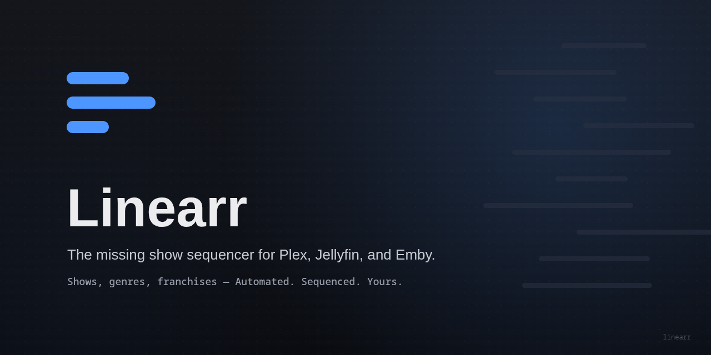
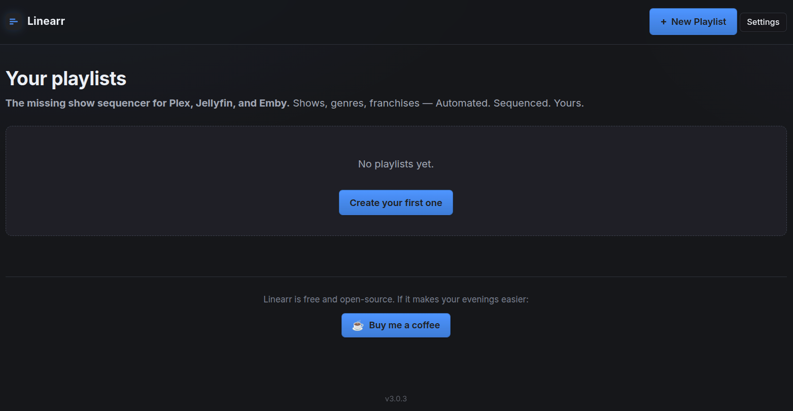
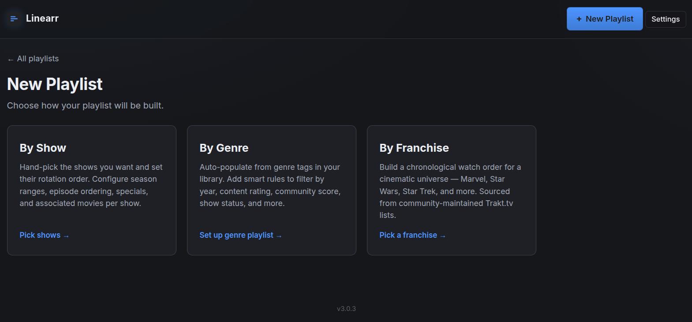
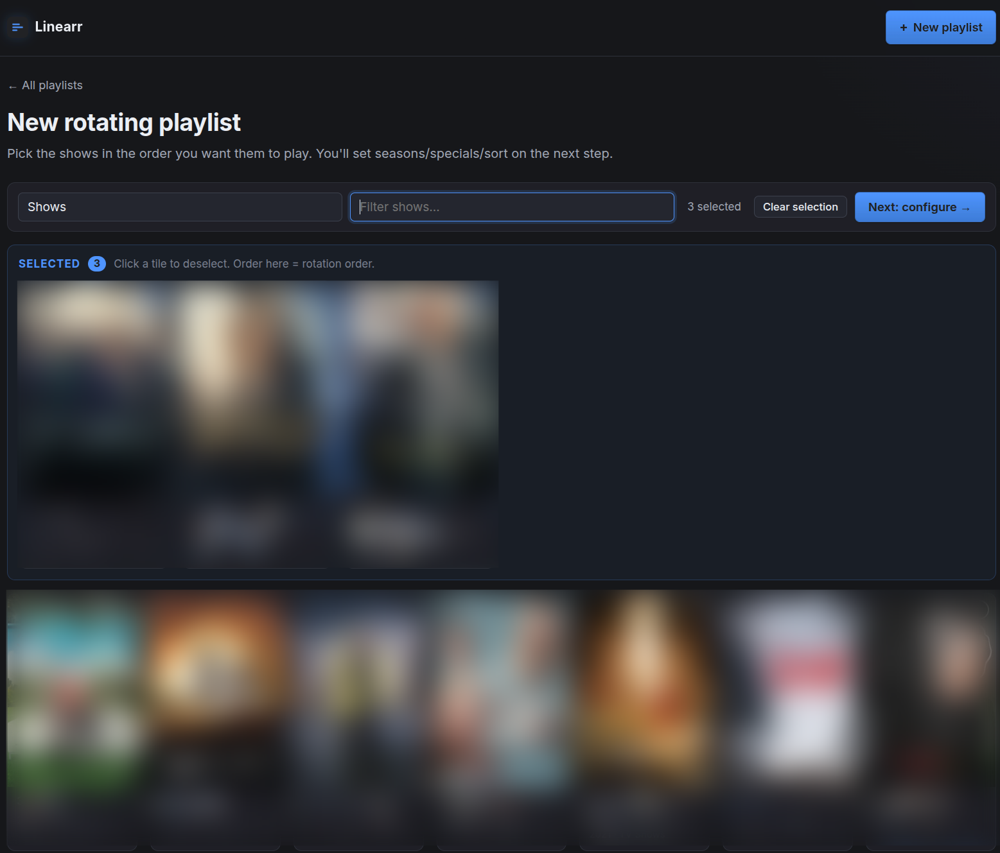
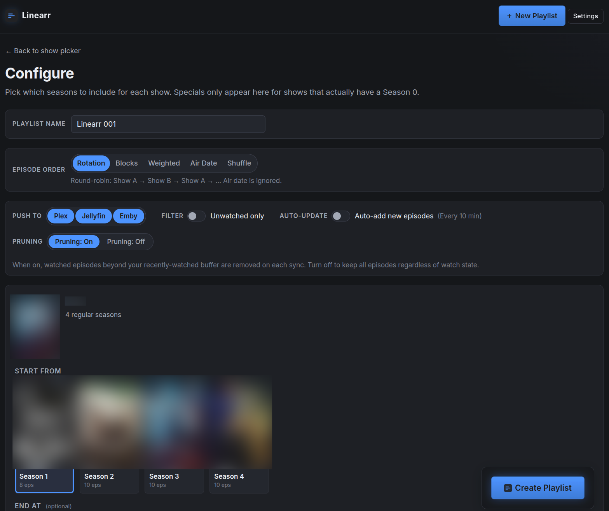

<p align="center">
  
</p>

# Linearr

### The missing show sequencer for Plex.
Automated round-robin rotation and chronological crossover alignment for your episodes (and their movies).

---

A web app that builds and maintains custom Plex playlists across multiple TV
shows (and their associated movies). Two ways to order episodes:

**Round-robin (Rotation mode)** — pick a stack of shows, and episodes
interleave in the order you picked them. Never sorted by air date across
shows.

```
Show A S01E01
Show B S01E01
Show A S01E02
Show B S01E02
...
```

**Chronological (Air Date mode)** — combine many shows and play them in the
order they originally aired, like Tuesday-night TV from 2008. **Multi-part
crossovers stay aligned** across different shows — when episodes share an air
date, the app reads `Part 1` / `Pt. 2` / `(1)` from titles and orders them
correctly.

Switch any playlist between modes at any time. Add a series' movies (e.g.
*Psych: The Movie*, *Mr. Monk's Last Case*) without leaving the configure
screen — they auto-detect from your movie library by title. Background
pruning keeps watched episodes from piling up, with a configurable
fall-asleep buffer.

> [!IMPORTANT]
> This app **never deletes media files or library items from Plex.** It only
> manages playlists. A runtime safety guard disables `delete()` on Episodes,
> Shows, Seasons, and Movies in the Plex API client — even an internal bug
> couldn't remove anything.

---

## Screenshots

<p align="center">
  
  <br><sub><em>Landing page — your playlists live here, with the support link in the footer.</em></sub>
</p>

<p align="center">
  
  <br><sub><em>Show picker — filter through your TV libraries and pick the shows you want in the rotation.</em></sub>
</p>

<p align="center">
  
  <br><sub><em>As you pick, shows jump into a pinned "Selected" tray at the top. Order in the tray = the rotation order.</em></sub>
</p>

<p align="center">
  
  <br><sub><em>Per-show configure: season range, specials toggle (only when Season 0 exists), sort mode (Rotation / Air Date), unwatched-only filter, and Auto-update toggle. Every change updates the preview list below without reloading the page.</em></sub>
</p>

---

## Table of contents

- [Screenshots](#screenshots)
- [Features](#features)
- [Quick start](#quick-start)
- [Install on Unraid](#install-on-unraid)
- [Install with Docker Compose](#install-with-docker-compose)
- [Install with `docker run`](#install-with-docker-run)
- [Install without Docker (Python)](#install-without-docker-python)
- [Finding your Plex token](#finding-your-plex-token)
- [Configuration reference](#configuration-reference)
- [Usage walk-through](#usage-walk-through)
- [How adds, removes, sort changes, and prunes work](#how-adds-removes-sort-changes-and-prunes-work)
- [Safety guarantee](#safety-guarantee)
- [Running tests](#running-tests)
- [Updating](#updating)
- [Troubleshooting](#troubleshooting)
- [Architecture](#architecture)
- [Contributing](#contributing)
- [Support the project](#support-the-project)

---

## Features

- **Two sort modes per playlist:**
  - **Rotation** — round-robin in the order you picked shows.
  - **Air Date** — chronological across every show; multi-part crossovers
    stay in order via `Part 1` / `Pt. 2` / `(N)` title parsing.
  - Toggle a playlist between modes any time — already-watched portion is
    untouched; the future portion regenerates instantly.
- **Per-show season range** — start from any season, end at any season; skip
  pilots or bad final seasons. Single-season shows skip the picker entirely
  with a clean "all N episodes included" note.
- **Smart specials** — Season 0 toggle only appears on shows that actually
  have specials. When enabled, specials slot in by air date.
- **Per-show "Include associated movies"** — for each show, the app searches
  your movie libraries by word-boundary title match (so *Mr. Monk's Last
  Case: A Monk Movie* attaches to *Monk*, and *Psych: The Movie* attaches to
  *Psych*). If matches are found, an in-line toggle appears; flipping it on
  reveals a poster grid + **Select all** button. Movies sort by air date in
  Air Date mode, or play at the end of their show's chronology in Rotation
  mode.
- **Unwatched-only filter** — per-playlist toggle that excludes any episode
  you've already watched anywhere in Plex (not just inside the playlist).
- **Show picker with selected tray** — clicking a poster moves it into a
  pinned tray at the top so you always see your picks; filter input;
  Clear-selection button.
- **Live episode preview (AJAX, no page reloads)** — every config change
  (sort mode, season range, specials, movies, unwatched filter) triggers a
  debounced fetch that swaps just the preview list in place. Client-side
  pagination 10/25/50/100/All with persistent page-size across sessions.
- **Add shows mid-rotation** — new shows splice in from your current
  playback point forward; watched portion stays intact.
- **Remove a show** — strips every one of its episodes (and associated
  movies) from the playlist. Files and library items are never touched.
- **Reorder the rotation** — up/down arrows on the playlist page rebuild
  the future portion to follow the new order.
- **Auto-prune watched** — keeps the last N watched episodes as a
  fall-asleep buffer; removes older watched ones every 10 minutes (both
  configurable).
- **Auto-sync new episodes** — same 10-minute sweep also splices
  newly-aired episodes and new seasons into your playlists automatically.
  Episodes removed from your Plex library drop out. Toggle off **globally**
  with `AUTO_SYNC=false`, or **per playlist** with the **Auto-update**
  pill on the playlist's detail page (defaults to Enabled). Disabled
  playlists are skipped on every sweep and stay locked until you edit them.
- **Cover art everywhere** — poster grids, season cards, playlist tiles; a
  thumbnail proxy means your Plex token never lands in HTML.
- **Never destructive** — runtime guard refuses any Plex API call that
  could delete media or library items.

---

## Quick start

```bash
git clone https://github.com/gillberg1111/linearr.git
cd linearr
cp .env.example .env
# edit .env — set PLEX_URL and PLEX_TOKEN
docker compose up -d
```

Open <http://localhost:5005>. That's it.

---

## Install on Unraid

The fastest reliable path is to add the container manually. Unraid saves
your configuration as a local template after the first run, so you can
edit/restart it from the Docker tab just like a Community App.

### Add Container manually

1. **Docker** tab → **Add Container**.
2. Fill in:

   | Field            | Value                                                            |
   | ---------------- | ---------------------------------------------------------------- |
   | **Name**         | `linearr`                                                   |
   | **Repository**   | `ghcr.io/gillberg1111/linearr:latest`                       |
   | **Network Type** | `Bridge`                                                         |
   | **WebUI**        | `http://[IP]:[PORT:5005]`                                        |

3. Click **Add another Path, Port, Variable, Label or Device** at the
   bottom and add the following one at a time:

   | Type     | Container Path / Key | Host Path / Value                  | Notes        |
   | -------- | -------------------- | ---------------------------------- | ------------ |
   | Port     | `5005` TCP           | `5005`                             |              |
   | Path     | `/data`              | `/mnt/user/appdata/linearr`   | Read/Write   |
   | Variable | `PLEX_URL`           | `http://<unraid-ip>:32400`         | required     |
   | Variable | `PLEX_TOKEN`         | *(your token)*                     | required     |
   | Variable | `WATCHED_KEEP`       | `2`                                | optional     |
   | Variable | `PRUNE_INTERVAL_MINUTES` | `10`                           | optional     |
   | Variable | `TV_LIBRARIES`       | *(blank = all show libraries)*     | optional     |

4. **Apply** → Unraid pulls the image from `ghcr.io` and starts the
   container.
5. Container icon → **WebUI** to open the rotator at
   `http://<unraid-ip>:5005`.

### Notes for Unraid

- **Plex on the same Unraid box?** Use the LAN IP of the host (e.g.
  `http://192.168.1.50:32400`), **not** `localhost` — the rotator container
  can't see Plex via `localhost`.
- **Appdata path**: SQLite state lives in
  `/mnt/user/appdata/linearr/rotator.db`. Back this up if you care
  about your playlist configs; episode/show state lives in Plex itself.
- **Networking**: Bridge mode is fine. No host network needed.
- **Updates**: container icon → **Check for Updates** (or **Force Update**).
  Unraid will repull the image and restart.
- **Community Applications**: not yet listed (submission in progress).
  Until then, the manual setup above is the path. The
  `templates/linearr.xml` in this repo is the CA template, and
  `ca_profile.xml` at the repo root describes the repository for CA.

---

## Install with Docker Compose

The repo includes a [`docker-compose.yml`](docker-compose.yml) that supports
both **build-from-source** (default) and **pull-from-registry**.

```bash
git clone https://github.com/gillberg1111/linearr.git
cd linearr
cp .env.example .env
# edit .env — set PLEX_URL and PLEX_TOKEN
docker compose up -d
```

To pull a pre-built image instead, edit `docker-compose.yml`:

```yaml
services:
  linearr:
    # build: .                                                # comment out
    image: ghcr.io/gillberg1111/linearr:latest          # uncomment
```

Logs / status:
```bash
docker compose logs -f
docker compose ps
docker compose down       # stop
docker compose pull && docker compose up -d   # update (registry image)
```

---

## Install with `docker run`

```bash
docker run -d \
  --name linearr \
  --restart unless-stopped \
  -p 5005:5005 \
  -v /path/to/your/appdata:/data \
  -e PLEX_URL=http://192.168.1.100:32400 \
  -e PLEX_TOKEN=YOUR_TOKEN_HERE \
  -e WATCHED_KEEP=2 \
  -e PRUNE_INTERVAL_MINUTES=10 \
  ghcr.io/gillberg1111/linearr:latest
```

---

## Install without Docker (Python)

You need Python 3.11+.

```bash
git clone https://github.com/gillberg1111/linearr.git
cd linearr
python -m venv .venv
source .venv/bin/activate            # Windows: .venv\Scripts\activate
pip install -r requirements.txt
cp .env.example .env                 # then edit
python app.py
```

The app listens on `WEB_HOST:WEB_PORT` (defaults `0.0.0.0:5005`).

systemd unit (`/etc/systemd/system/linearr.service`):
```ini
[Unit]
Description=Linearr
After=network.target

[Service]
WorkingDirectory=/opt/linearr
ExecStart=/opt/linearr/.venv/bin/python app.py
Restart=on-failure
EnvironmentFile=/opt/linearr/.env

[Install]
WantedBy=multi-user.target
```

`systemctl daemon-reload && systemctl enable --now linearr`.

---

## Finding your Plex token

1. Open the Plex web app and play any item.
2. **⋮** menu on the playing item → **Get Info** → **View XML**.
3. The new tab's URL ends with `?X-Plex-Token=XXXXXXX...`. Copy that value.
4. Full instructions: <https://support.plex.tv/articles/204059436-finding-an-authentication-token-x-plex-token/>

The token grants admin access to your server — treat it like a password. The
app never exposes it in HTML; posters proxy through the server.

---

## Configuration reference

All values are environment variables.

| Variable                 | Required | Default                | Notes                                                                                          |
| ------------------------ | -------- | ---------------------- | ---------------------------------------------------------------------------------------------- |
| `PLEX_URL`               | yes      | —                      | e.g. `http://192.168.1.100:32400`. LAN IP, not `plex.tv`.                                      |
| `PLEX_TOKEN`             | yes      | —                      | X-Plex-Token (see above).                                                                      |
| `WEB_HOST`               | no       | `0.0.0.0`              | `127.0.0.1` to restrict to localhost.                                                          |
| `WEB_PORT`               | no       | `5005`                 | HTTP port.                                                                                     |
| `DB_PATH`                | no       | `/data/rotator.db`     | SQLite file. Container `/data` is the persistent volume.                                       |
| `WATCHED_KEEP`           | no       | `2`                    | Recently-watched episodes to leave in each playlist as a fall-asleep buffer.                   |
| `PRUNE_INTERVAL_MINUTES` | no       | `10`                   | How often the prune + auto-sync sweep runs.                                                    |
| `AUTO_SYNC`              | no       | `true`                 | When true, newly-aired episodes and new seasons are spliced into managed playlists every sweep. Set `false` to lock playlists at creation. |
| `TV_LIBRARIES`           | no       | *(all show libs)*      | Comma-separated library names to source shows from. Blank = every "show" library.              |
| `FLASK_SECRET`           | no       | `dev-secret-change-me` | Random secret for Flask session cookies. `openssl rand -hex 32`.                               |

The app searches every **movie** library on the server when looking for
associated movies — that isn't currently filterable.

---

## Usage walk-through

### Create a new playlist

1. Click **+ New playlist** in the top-right.
2. **Name it**, then click the posters of the shows you want. They jump
   into the **Selected** tray pinned at the top. Filter or **Clear
   selection** as needed. When ready: **Next: configure →**.
3. **Configure** each show:
   - For multi-season shows: pick a **Start from** season and an optional
     **End at** season (defaults to *Entire Series*).
   - If the show has a Season 0, toggle **Include specials** on/off.
   - If the app found any movies in your library whose titles match the
     show name, an **Include associated movies (N found)** toggle appears.
     Flip it on to reveal the matched movies with a **Select all** button
     and individual checkboxes.
   - At the top of the page: choose **Rotation** or **Air Date** episode
     order, and the **Only unwatched episodes** toggle.
4. The **Preview** at the bottom updates automatically (no page reload) as
   you change settings. It shows every episode that would land in the
   playlist, paginated 10/25/50/100/All with Prev/Next buttons. Air dates
   are visible so you can sanity-check a chronological build.
5. **Create playlist** commits — the result appears in every Plex client as
   a native playlist.

### Edit a playlist later

From the playlist's detail page:
- **Rotation / Air Date** pill — flip to rebuild the future portion of the
  playlist in the other order.
- **All episodes / Unwatched only** pill — same idea, but for the watched
  filter.
- **Add another show** — picker → configure → splices in.
- **Remove** below any show — wipes every one of its episodes from the
  playlist (and any of its movies you added).
- **▲ / ▼** to reorder; **Save order** rebuilds the future portion.
- **Prune watched now** triggers cleanup outside the 10-minute schedule.

---

## How adds, removes, sort changes, and prunes work

- **Add show**: finds the current playback point in the Plex playlist
  (last watched/partially-watched item). Everything before it stays.
  After it, the future portion is regenerated so all shows — including
  the new one — interleave (rotation) or chronologize (air-date) in their
  next episodes.
- **Remove show**: every episode of that show is deleted **from the
  playlist** (actual media files and library entries are never touched).
- **Reorder rotation**: same logic as add — kept portion stays, future
  portion is regenerated to honor the new order.
- **Switch sort mode**: same again — kept portion stays, future portion
  is regenerated using the new mode.
- **Switch unwatched-only**: same again — kept portion stays; the future
  portion is rebuilt under the new filter.
- **Prune sweep**: every `PRUNE_INTERVAL_MINUTES`, watched episodes older
  than the most recent `WATCHED_KEEP` are removed.
- **Auto-sync** (`AUTO_SYNC=true`, default): on the same interval, each
  managed playlist is re-checked against current Plex metadata. Newly-aired
  episodes and new seasons (if within the show's configured range) splice
  into the future portion of the playlist; episodes deleted from your Plex
  library drop out. Already-played portion is never disturbed. Each
  playlist also has its own **Auto-update: Enabled / Disabled** pill — set
  to Disabled, the scheduler skips that one playlist regardless of the
  global env var.

### Crossover alignment (Air Date mode)

When sorting by Air Date, two things happen automatically:

1. **Same-day adjacency.** Episodes that aired on the same date land back
   to back, regardless of which shows they're from.
2. **Multi-part ordering.** Within a same-day group, episodes whose titles
   contain `Part 1` / `Pt. 2` / `(1)` etc. sort by their part number so a
   2-part crossover plays in the right order even when Parts 1 and 2 are
   on different shows.

Throw **Law & Order**, **L&O: SVU**, and **L&O: Criminal Intent** into one
Air Date playlist and you'll get a chronological mix with their crossover
two-parters intact.

### Movie placement

- **Air Date mode:** movies use their `originallyAvailableAt` date and slot
  in chronologically. *Mr. Monk's Last Case* (2023) plays after *Monk*
  S08E16 (2009).
- **Rotation mode:** movies play at the *end* of their associated show's
  chronology — after the show's last episode.

---

## Safety guarantee

This app **never** deletes media files or library items from Plex. The only
destructive Plex operations it performs:

| Operation                | What it touches                          |
| ------------------------ | ---------------------------------------- |
| `Playlist.delete()`      | The rotation playlist (metadata only).   |
| `Playlist.removeItem()`  | One entry IN a playlist. The underlying Episode/Show/Movie/file is untouched. |

`plex_client.py` installs a runtime safety guard at import time:

```python
for cls in (Episode, Show, Season, Movie):
    cls.delete = _refuse_delete   # raises RuntimeError on call
```

So `episode.delete()`, `show.delete()`, `movie.delete()`, etc. fail
immediately with a clear error instead of doing anything. `Playlist.delete()`
is intentionally left intact (playlists are pure metadata).

---

## Running tests

The pure rotation/sort/prune logic in `rotation.py` has a self-contained test
suite — no Plex or network required.

```bash
python tests.py
# 31 passed, 0 failed, 31 total
```

Covers: round-robin interleaving, splice-from-current-position, watched
pruning with last-N retention, Part N detection, air-date sequence with
crossover Part 1/2 alignment, show-order tie-breaks, rebuild-tail in both
rotation and air-date modes, and movie identity preservation across rebuilds.
If you modify `rotation.py`, run this first.

---

## Updating

**Docker Compose (built locally):**
```bash
git pull
docker compose build --pull
docker compose up -d
```

**Docker Compose (registry image):**
```bash
docker compose pull
docker compose up -d
```

**Unraid:** click the container icon → **Check for Updates** (or **Force Update**).

**Python:**
```bash
git pull
.venv/bin/pip install -r requirements.txt
systemctl restart linearr   # if using the systemd unit
```

SQLite migrations run automatically on startup (lightweight `ALTER TABLE`
calls for new columns). Existing Plex playlists are never modified during
updates.

---

## Troubleshooting

**"Couldn't reach Plex" on the New playlist page**
- Confirm `PLEX_URL` is reachable from inside the container:
  ```bash
  docker exec -it linearr python -c "import urllib.request; print(urllib.request.urlopen('YOUR_PLEX_URL/identity').status)"
  ```
- If Plex is on the same host as the rotator, **don't** use
  `localhost`/`127.0.0.1` — use the LAN IP.

**Token error / 401**
- Tokens rotate when you sign out everywhere. Refresh via Plex web → Get Info.

**Playlist looks out of order after a manual edit in Plex**
- The rotator owns the future portion of the playlist. Manual reorders
  inside Plex get overwritten on the next add/remove/reorder/sort change.
  Use the rotator's controls instead.

**Associated movies don't appear for a show**
- The matcher uses word-boundary title match. The movie title must
  literally contain the show's name as a word. *"Mr. Monk's Last Case: A
  Monk Movie"* matches *Monk*; *"Funky Monk"* would match too but
  *"Psychic Detective"* wouldn't match *Psych* (no boundary).
- If you have the movie but it isn't matching, check the title metadata in
  Plex — sometimes scrapers pull a localized title that doesn't include
  the show name.

**Prune isn't removing anything**
- Episodes have to be marked watched in Plex (~90% playback). Scrub-and-skip
  may not register.

**"Address already in use"**
- Something else is on `WEB_PORT`. Change `WEB_PORT` in `.env` and the
  published port.

**Logs**
```bash
docker compose logs -f                 # compose
docker logs -f linearr            # plain docker
journalctl -u linearr -f          # systemd
```

---

## Architecture

```
app.py                       — Flask routes (/, /new, /new/configure,
                                /playlist/<id>, /thumb, /api/preview, …)
service.py                   — High-level ops: create / add / remove /
                                reorder / set-sort / set-unwatched / prune
plex_client.py               — Wraps python-plexapi; installs the no-delete
                                safety guard; movie title-matcher
rotation.py                  — Pure interleave / air-date-sort / splice /
                                prune logic; movies tracked by rating_key.
                                Unit-tested.
db.py                        — SQLite schema, migrations, helpers
scheduler.py                 — APScheduler background prune job
templates/
  base.html                  — Layout + top bar
  index.html                 — Playlist landing page
  new.html                   — Show picker (with tray + clear)
  playlist.html              — Per-playlist detail page
  configure.html             — Per-show season range, specials, movies,
                                sort/filter pills, AJAX preview
  _preview_partial.html      — Just the preview list (rendered server-side
                                on initial load and via /api/preview AJAX)
  linearr.xml                — Unraid Community Applications template (XML),
                                lives here per CA's required folder structure
static/
  picker.js                  — Tray-based show picker (reusable)
  style.css                  — All styles
images/                      — Logo, banner, favicons, Unraid icon (SVG + PNG)
ca_profile.xml               — Repository-wide metadata for Unraid CA
tests.py                     — Self-contained unit tests for rotation.py
```

The Plex playlist itself is the source of truth for episode order. SQLite
only stores configuration (which shows in which playlist, their seasons,
specials choice, included movies, position, and sort + filter modes).

---

## Contributing

Issues and PRs welcome. The rotation/sort logic in `rotation.py` is pure
and unit-tested — keep it that way; side effects belong in `service.py` or
`plex_client.py`. Run `python tests.py` before any PR.

License: [MIT](LICENSE).

---

## Support the project

Linearr is free, open-source, and has no business model behind it. If it
saves you time and you'd like to chip in:

[☕ Buy me a coffee](https://buymeacoffee.com/gillberg1111)

The button is also embedded at the bottom of the app's landing page.

---

> Linearr follows the `*arr` naming convention popular in the Plex / Sonarr /
> Radarr ecosystem, but it is not affiliated with the Servarr project or
> Plex Inc. "Plex" is a trademark of Plex GmbH.
