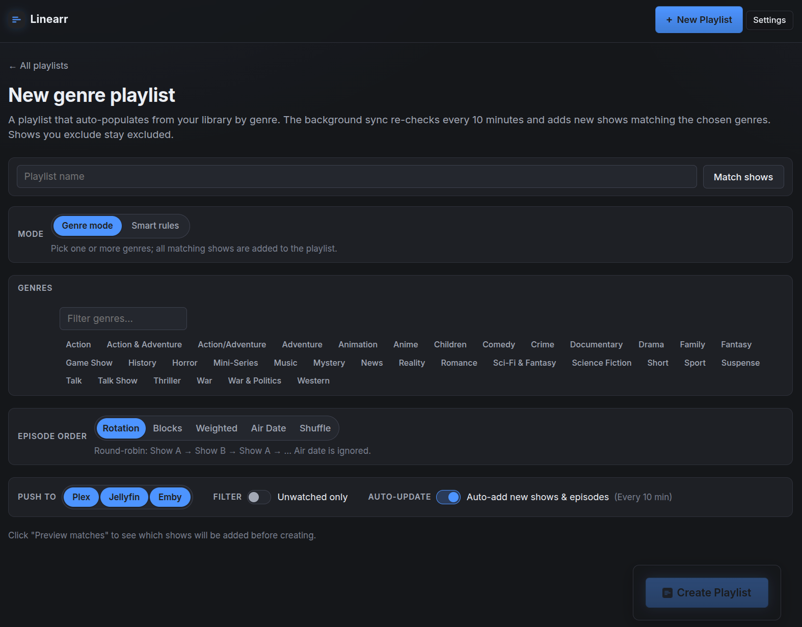
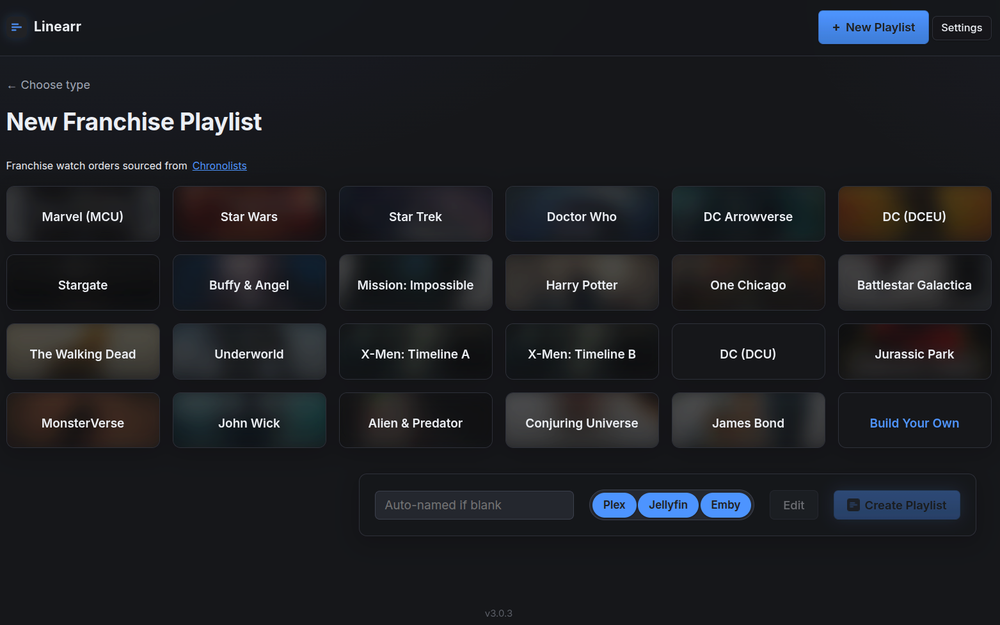
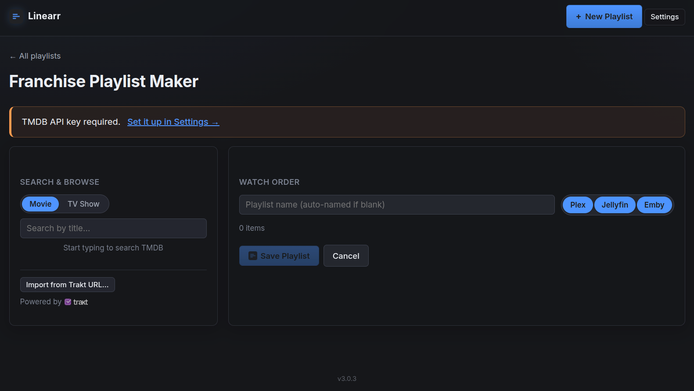

<p align="center">
  
</p>

# Linearr

### The missing show sequencer for Plex, Jellyfin, and Emby.
Shows, genres, franchises — Automated. Sequenced. Yours.

---

Linearr builds and maintains custom playlists across multiple TV shows (and
their associated movies) on **Plex**, **Jellyfin**, **Emby**, or any
combination of them at once.

Pick a set of shows and Linearr weaves their episodes into a single playlist —
round-robin, chronological by air date, weighted, blocked, or shuffled — then
keeps it fed with new episodes and pruned of ones you've watched, on a
schedule, in the background. Build by hand-picking shows, dynamically by genre,
or as a chronological **franchise** watch order mixing movies and series.

Configure any one, two, or all three backends. Each playlist independently
targets whichever backends you select (mirrored to each server in lockstep,
using each server's own library and watch state). Single-backend installs see
no extra UI — the "Push to" picker only appears when more than one backend is
configured.

> [!IMPORTANT]
> **Linearr never deletes media files or library items from Plex, Jellyfin, or
> Emby.** It only manages playlists. Per-backend safety guards (described
> [below](#safety-guarantee)) make this structurally impossible — even an
> internal bug can't remove your media — and unit tests verify the guards hold.

---

## Five ways to order episodes

**Rotation** — round-robin across shows in the order you picked them.

```
Show A S01E01
Show B S01E01
Show A S01E02
Show B S01E02
```

**Block Scheduling** — N consecutive episodes per show before rotating
("3 Simpsons, then 3 Futuramas, then 3 South Parks…").

**Weighted Rotation** — give heavy shows more slots per cycle ("The Simpsons
gets 3 episodes for every 1 of Firefly").

**Air Date** — chronological across every show, like Tuesday-night TV from
2008. **Multi-part crossovers stay aligned** across different shows via title
parsing (`Part 1` / `Pt. 2` / `(1)`), with **manual crossover grouping** for
edge cases the heuristic misses.

**Intelligent Shuffle** — random sequence, but each show's episodes stay in
chronological order and same-show consecutive plays are avoided when possible.
Seed-based (deterministic); reshuffle any time.

Switch any playlist between modes at any time — the already-watched portion is
untouched; the future portion regenerates instantly.

---

## Screenshots

<p align="center">
  
  <br><sub><em>Landing page — your playlists live here, each card showing its type, backend(s), and episode count.</em></sub>
</p>

<p align="center">
  
  <br><sub><em>Show picker — filter through your TV libraries and pick the shows you want in the rotation.</em></sub>
</p>

<p align="center">
  
  <br><sub><em>As you pick, shows jump into a pinned "Selected" tray at the top. Order in the tray = the rotation order.</em></sub>
</p>

<p align="center">
  
  <br><sub><em>Per-show configure: season range, specials toggle, sort mode, unwatched-only filter, pruning, and "Push to" backend picker. Every change updates the live preview below without reloading.</em></sub>
</p>

<p align="center">
  
  <br><sub><em>Create playlist based on genre.</em></sub>
</p>

<p align="center">
  
  <br><sub><em>Select franchise based playlist that are build in chronological order from Chronolists.com.</em></sub>
</p>

<p align="center">
  
  <br><sub><em>Build your own franchise (or any style really) playlist, import an existing list from Trakt to use or edit, or edit one of the existing franchise playlists.</em></sub>
</p>

---

## Table of contents

- [Features](#features)
- [Quick start](#quick-start)
- [Install on Unraid](#install-on-unraid)
- [Install with Docker Compose](#install-with-docker-compose)
- [Install with `docker run`](#install-with-docker-run)
- [Install without Docker (Python)](#install-without-docker-python)
- [Connecting your backends](#connecting-your-backends)
  - [Finding your Plex token](#finding-your-plex-token)
  - [Jellyfin authentication](#jellyfin-authentication)
  - [Emby authentication](#emby-authentication)
- [Configuration reference](#configuration-reference)
- [The Settings page](#the-settings-page)
- [Usage walk-through](#usage-walk-through)
- [How adds, removes, sort changes, and prunes work](#how-adds-removes-sort-changes-and-prunes-work)
- [Safety guarantee](#safety-guarantee)
- [REST API & webhooks](#rest-api--webhooks)
- [Running tests](#running-tests)
- [Updating](#updating)
- [Troubleshooting](#troubleshooting)
- [Architecture](#architecture)
- [Contributing](#contributing)
- [Support the project](#support-the-project)
- [Acknowledgments](#acknowledgments)
- [License & disclaimer](#license--disclaimer)

---

## Features

### Backends

- **Plex, Jellyfin, and Emby — any combination.** Configure one, two, or all
  three. Each playlist targets whichever backends you check (mirrored to each
  server independently, using each server's own library and watch state). When
  more than one backend is configured, a per-backend checkbox picker appears:
  `Push to: ☑ Plex ☑ Jellyfin ☑ Emby` — select any subset. With one backend, the
  picker is hidden and that backend is used. (Plex uses a token; Jellyfin a
  username/password; Emby an API key.)
- **Configure backends in the UI or via env vars.** Set credentials with
  environment variables *or* on the **Settings → Media Backends** page (each
  with a "Test connection" button). UI values override the matching env var,
  take effect immediately with no restart, and env vars remain the fallback.
- **Cross-backend matching.** Shows added to a multi-backend playlist are
  matched on the other side(s) by **any shared provider id — TVDB, TMDB, or
  IMDB** — then normalized title + year as a fallback. Matching on any shared id
  bridges libraries scraped with different metadata agents and title
  disagreements (e.g. "Stargirl" on Plex ↔ "DC's Stargirl" on Jellyfin). Matched
  IDs are persisted per backend. (Bundled **franchise** playlists are TMDB-keyed,
  so they additionally resolve TMDB→TVDB/IMDB via TMDB to match a TVDB/IMDB-only
  library — that bridge needs a free TMDB API key.)
- **Heal-on-sync + manual link.** Every sync re-attempts matching for shows
  missing an ID on one side. An informational (never blocking) banner lists
  shows not on every targeted backend; add the show to that library and the
  next sync heals it, or use **Link manually…** to pick the exact match.
- **Persistent cross-backend matches.** When a backend names a show differently
  and has no shared provider ID, **Link manually…** records a global "same show"
  link that the matcher honors everywhere — genre builds, the show picker, and
  sync all treat them as one. Manage these under **Settings → Manual show
  matches**.

### Playlist types

- **By Show** — hand-pick shows; they interleave per your chosen sort mode.
- **By Genre** — auto-populates from your library by genre, re-querying every
  sweep so new matching shows are added automatically. Genres are chosen from a
  **pill picker** scraped from your backends (refreshed weekly). Exclude
  individual shows and they stay excluded across syncs.
- **Smart rules** (within genre mode) — build a rule set: Genre (include), Year
  min/max, Status (Ended/Continuing), Content rating, Season count min/max, and
  Rating min. Genre rules narrow the pool; the rest combine with AND logic as
  post-filters.
- **By Franchise** — a chronologically ordered playlist mixing movies, full
  series, individual seasons, and individual episodes — for MCU watch orders,
  Star Wars timelines, Star Trek chronology, etc. **23 franchises ship
  pre-baked** (sourced from [Chronolists](https://chronolists.com) and curated
  community Trakt lists): MCU, Star Wars, DCEU, DCU, Arrowverse, Star Trek,
  Stargate, Doctor Who, Buffy & Angel, X-Men (two timelines), Mission:
  Impossible, Harry Potter, One Chicago, Battlestar Galactica, The Walking Dead,
  Underworld, Jurassic Park, MonsterVerse, John Wick, Alien & Predator,
  Conjuring Universe, James Bond. The picker **grows automatically** as
  Chronolists expands — new lists appear (with cover art) without a release
  update — and a franchise Linearr tracks under Trakt auto-switches to
  Chronolists when it shows up there.
- **Franchise Playlist Maker** (`/franchise-maker`) — a visual builder for fully
  custom watch orders. Search TMDB for movies/TV, browse seasons & episodes
  inline, **+ Add Series** to drop all seasons at once, **+ Add all eps** to drop
  every episode of a season or series as individual, reorderable rows (perfect
  for interleaving overlapping shows), drag to reorder, and **Import from Trakt
  URL** to seed from any public list. Editing a bundled
  franchise spawns a custom copy (the original is never touched) with a
  **Restore default** button. Needs a free TMDB API key (set on Settings).

### Sequencing & content

- **Five sort modes** (Rotation, Block, Weighted, Air Date, Intelligent
  Shuffle) — switch any time; the watched portion is preserved.
- **Per-show season range** — start/end at any season; single-season shows skip
  the picker with an "all N episodes included" note.
- **Smart specials** — a Season 0 toggle appears only on shows that have
  specials; when on, they slot in by air date.
- **Associated movies** — per show, Linearr word-boundary-matches your movie
  libraries (so *Psych: The Movie* attaches to *Psych*). A toggle reveals a
  poster grid + Select all. Movies sort by air date (Air Date mode) or play at
  the end of their show's run (Rotation).
- **Per-episode exclusions** — exclude specific episodes via a season-grouped
  accordion picker; applies across all configured backends.
- **Manual crossover grouping** (Air Date) — link specific episodes across
  shows into an explicit group when the "Part N" heuristic misses.
- **Unwatched-only filter** — per-playlist toggle excluding episodes you've
  watched anywhere on the backend.
- **Per-playlist pruning toggle** — works on every playlist type (show, genre,
  and franchise). Default on for show/genre, off (opt-in) for franchise. Pruning
  is idempotent: enabling it converges the playlist to a small recent-watched
  buffer plus the unwatched future and keeps it there, even with unwatched-only
  off.

### Automation & maintenance

- **Auto-prune watched** — keeps the last `WATCHED_KEEP` watched items as a
  fall-asleep buffer; removes older ones every `PRUNE_INTERVAL_MINUTES`. Applies
  to show, genre, and (opt-in) franchise playlists.
- **Auto-sync new episodes** — the same sweep splices newly-aired episodes and
  new seasons into playlists and drops episodes removed from your library.
  Toggle globally (`AUTO_SYNC`) or per playlist (**Auto-update** pill).
- **Manual "Sync Now"** — force an immediate sync; reports added/removed counts.
- **Metadata refresh** — a button asks every configured backend to re-fetch
  metadata for all shows in the playlist (useful when air dates look wrong).
- **Cover art** — deterministic TMDB posters on franchise playlists; poster
  grids and season cards throughout. A thumbnail proxy keeps every backend
  credential server-side.

### Interface & integrations

- **Live AJAX preview** — every config change swaps just the preview list in
  place, paginated 10/25/50/100/All.
- **Mobile-responsive** — breakpoints at 768 px and 480 px.
- **REST API** (`/api/v1/`) — JSON endpoints for external integrations, bearer-
  token auth. See [REST API & webhooks](#rest-api--webhooks).
- **Outbound webhooks** — POST a JSON payload on playlist create / sync /
  delete to Home Assistant, Ntfy, Gotify, Discord, Slack, or any HTTP endpoint.

---

## Quick start

```bash
git clone https://github.com/gillberg1111/linearr.git
cd linearr
cp .env.example .env
# Edit .env — set any of: PLEX_URL+PLEX_TOKEN,
# JELLYFIN_URL+JELLYFIN_USERNAME+JELLYFIN_PASSWORD, EMBY_URL+EMBY_API_KEY.
docker compose up -d
```

Open <http://localhost:5005>. With more than one backend configured you'll see
a `Push to: ☑ Plex ☑ Jellyfin ☑ Emby` checkbox picker when creating playlists;
with only one, that backend is used automatically. (You can also add backends
later on the **Settings** page — no env edit or restart required.)

---

## Install on Unraid

The fastest reliable path is to add the container manually. Unraid saves your
configuration as a local template after the first run, so you can edit/restart
it from the Docker tab just like a Community App.

1. **Docker** tab → **Add Container**.
2. Fill in:

   | Field            | Value                                     |
   | ---------------- | ----------------------------------------- |
   | **Name**         | `linearr`                                 |
   | **Repository**   | `ghcr.io/gillberg1111/linearr:latest`     |
   | **Network Type** | `Bridge`                                  |
   | **WebUI**        | `http://[IP]:[PORT:5005]`                 |

3. Click **Add another Path, Port, Variable…** and add the following one at a
   time:

   | Type     | Container Path / Key     | Host Path / Value             | Notes                                            |
   | -------- | ------------------------ | ----------------------------- | ------------------------------------------------ |
   | Port     | `5005` TCP               | `5005`                        |                                                  |
   | Path     | `/data`                  | `/mnt/user/appdata/linearr`   | Read/Write                                       |
   | Variable | `PLEX_URL`               | `http://<unraid-ip>:32400`    | required *if Plex enabled* (blank to disable)    |
   | Variable | `PLEX_TOKEN`             | *(your token)*                | required *if Plex enabled*                       |
   | Variable | `JELLYFIN_URL`           | `http://<unraid-ip>:8096`     | required *if Jellyfin enabled*                   |
   | Variable | `JELLYFIN_USERNAME`      | *(your Jellyfin username)*    | required *if Jellyfin enabled*                   |
   | Variable | `JELLYFIN_PASSWORD`      | *(your Jellyfin password)*    | required *if Jellyfin enabled*                   |
   | Variable | `EMBY_URL`               | `http://<unraid-ip>:8096`     | required *if Emby enabled*                       |
   | Variable | `EMBY_API_KEY`           | *(Emby API key)*              | required *if Emby enabled*                       |
   | Variable | `EMBY_USERNAME`          | *(your Emby username)*        | optional — picks which user owns playlists       |
   | Variable | `WATCHED_KEEP`           | `2`                           | optional                                         |
   | Variable | `PRUNE_INTERVAL_MINUTES` | `10`                          | optional                                         |
   | Variable | `TV_LIBRARIES`           | *(blank = all show libraries)*| optional — applies to ALL backends if set        |

   At least one backend (Plex, Jellyfin, *or* Emby) must be configured; any
   combination works. You can also add/change backends later on the **Settings →
   Media Backends** page (no restart needed).

4. **Apply** → Unraid pulls the image and starts the container.
5. Container icon → **WebUI** to open Linearr at `http://<unraid-ip>:5005`.

### Notes for Unraid

- **Backends on the same Unraid box?** Use the LAN IP of the host (e.g.
  `http://192.168.1.50:32400`), **not** `localhost` — the container can't reach
  the host via `localhost`.
- **Single-backend installs:** fill in only that backend's vars and leave the
  others blank. The picker is hidden and every playlist targets it.
- **Appdata:** SQLite state lives in `/mnt/user/appdata/linearr/rotator.db` —
  back it up to preserve your playlist configs. Episode/show state lives in
  each backend.
- **Updates:** container icon → **Check for Updates** (or **Force Update**).
- **Community Applications:** the `templates/linearr.xml` in this repo is the CA
  template; `ca_profile.xml` describes the repository for CA.

---

## Install with Docker Compose

The repo includes a [`docker-compose.yml`](docker-compose.yml) that supports
both **build-from-source** (default) and **pull-from-registry**.

```bash
git clone https://github.com/gillberg1111/linearr.git
cd linearr
cp .env.example .env        # then edit — set your backend credentials
docker compose up -d
```

To pull a pre-built image instead of building, edit `docker-compose.yml`:

```yaml
services:
  linearr:
    # build: .                                       # comment out
    image: ghcr.io/gillberg1111/linearr:latest       # uncomment
```

```bash
docker compose logs -f                          # logs
docker compose down                             # stop
docker compose pull && docker compose up -d     # update (registry image)
```

---

## Install with `docker run`

Single backend (swap in the vars for whichever you use):

```bash
# Plex
docker run -d --name linearr --restart unless-stopped \
  -p 5005:5005 -v /path/to/appdata:/data \
  -e PLEX_URL=http://192.168.1.100:32400 -e PLEX_TOKEN=YOUR_TOKEN \
  ghcr.io/gillberg1111/linearr:latest

# Jellyfin
docker run -d --name linearr --restart unless-stopped \
  -p 5005:5005 -v /path/to/appdata:/data \
  -e JELLYFIN_URL=http://192.168.1.100:8096 \
  -e JELLYFIN_USERNAME=USER -e JELLYFIN_PASSWORD=PASS \
  ghcr.io/gillberg1111/linearr:latest

# Emby
docker run -d --name linearr --restart unless-stopped \
  -p 5005:5005 -v /path/to/appdata:/data \
  -e EMBY_URL=http://192.168.1.100:8096 -e EMBY_API_KEY=YOUR_KEY \
  ghcr.io/gillberg1111/linearr:latest
```

All three at once (per-backend checkbox picker enabled):

```bash
docker run -d --name linearr --restart unless-stopped \
  -p 5005:5005 -v /path/to/appdata:/data \
  -e PLEX_URL=http://192.168.1.100:32400 -e PLEX_TOKEN=YOUR_TOKEN \
  -e JELLYFIN_URL=http://192.168.1.100:8096 \
  -e JELLYFIN_USERNAME=USER -e JELLYFIN_PASSWORD=PASS \
  -e EMBY_URL=http://192.168.1.100:8097 -e EMBY_API_KEY=YOUR_KEY \
  ghcr.io/gillberg1111/linearr:latest
```

---

## Install without Docker (Python)

You need Python 3.11+.

```bash
git clone https://github.com/gillberg1111/linearr.git
cd linearr
python -m venv .venv
source .venv/bin/activate            # Windows: .venv\Scripts\activate
pip install -r requirements.txt
cp .env.example .env                 # then edit
python app.py
```

The app listens on `WEB_HOST:WEB_PORT` (defaults `0.0.0.0:5005`).

<details>
<summary>systemd unit</summary>

`/etc/systemd/system/linearr.service`:

```ini
[Unit]
Description=Linearr
After=network.target

[Service]
WorkingDirectory=/opt/linearr
ExecStart=/opt/linearr/.venv/bin/python app.py
Restart=on-failure
EnvironmentFile=/opt/linearr/.env

[Install]
WantedBy=multi-user.target
```

`systemctl daemon-reload && systemctl enable --now linearr`
</details>

---

## Connecting your backends

You can set these as environment variables **or** on the **Settings → Media
Backends** page in the app (UI values override env vars and take effect without
a restart). At least one backend must be configured.

### Finding your Plex token

1. Open the Plex web app and play any item.
2. **⋮** on the playing item → **Get Info** → **View XML**.
3. The new tab's URL ends with `?X-Plex-Token=XXXXXXX…`. Copy that value.
4. Full instructions: <https://support.plex.tv/articles/204059436-finding-an-authentication-token-x-plex-token/>

The token grants admin access — treat it like a password. Linearr never exposes
it in HTML; posters proxy through the server.

### Jellyfin authentication

Linearr authenticates against Jellyfin with **username + password** (NOT an API
key). Set `JELLYFIN_USERNAME` / `JELLYFIN_PASSWORD`.

> [!NOTE]
> **Why not an API key?** Jellyfin's API-key auth is broken on the playlist
> endpoints Linearr needs (issues
> [#15600](https://github.com/jellyfin/jellyfin/issues/15600) /
> [#12999](https://github.com/jellyfin/jellyfin/issues/12999)) — they return
> 400 "Guid can't be empty" with a key. Authenticating as a user via
> `POST /Users/AuthenticateByName` (the same path the official web UI uses)
> works everywhere. The password is used only for that call and held in memory
> — never written to disk. The resulting token is memory-only and rotated on
> any 401. A stable DeviceId persists to `<DB_DIR>/device_id`. A dedicated
> low-privilege Jellyfin user works fine.

### Emby authentication

Linearr authenticates against Emby with an **API key** (`EMBY_API_KEY`) sent via
the `X-Emby-Token` header — Emby (unlike Jellyfin) isn't affected by the API-key
playlist bug. Create one in **Emby → Settings → Advanced → API Keys → New API
Key**.

> [!NOTE]
> `EMBY_USERNAME` is optional — it selects which Emby user owns the playlists
> Linearr creates. If omitted, Linearr uses the first administrator. **Use an
> API key tied to an account with permission to manage/delete playlists**, or
> deletes from Linearr won't take effect on the server. A stable DeviceId
> persists to `<DB_DIR>/emby_device_id`.

---

## Configuration reference

All values are environment variables (backend credentials can alternatively be
set on the Settings page). **At least one backend must be configured.**

| Variable                 | Required     | Default                | Notes                                                                                          |
| ------------------------ | ------------ | ---------------------- | ---------------------------------------------------------------------------------------------- |
| `PLEX_URL`               | if Plex      | —                      | e.g. `http://192.168.1.100:32400`. LAN IP, not `plex.tv`. Blank disables Plex.                 |
| `PLEX_TOKEN`             | if Plex      | —                      | X-Plex-Token (see above).                                                                      |
| `JELLYFIN_URL`           | if Jellyfin  | —                      | e.g. `http://192.168.1.100:8096`.                                                              |
| `JELLYFIN_USERNAME`      | if Jellyfin  | —                      | Jellyfin login name.                                                                           |
| `JELLYFIN_PASSWORD`      | if Jellyfin  | —                      | Held in memory only; never written to DB.                                                      |
| `EMBY_URL`               | if Emby      | —                      | e.g. `http://192.168.1.100:8096`.                                                              |
| `EMBY_API_KEY`           | if Emby      | —                      | Emby → Settings → Advanced → API Keys. Needs playlist manage/delete permission.                |
| `EMBY_USERNAME`          | no           | *(first admin)*        | Which Emby user owns created playlists.                                                        |
| `WEB_HOST`               | no           | `0.0.0.0`              | `127.0.0.1` to restrict to localhost.                                                          |
| `WEB_PORT`               | no           | `5005`                 | HTTP port.                                                                                     |
| `DB_PATH`                | no           | `./data/rotator.db`    | SQLite file. Docker overrides to `/data/rotator.db`.                                           |
| `WATCHED_KEEP`           | no           | `2`                    | Recently-watched episodes left in each playlist as a fall-asleep buffer.                       |
| `PRUNE_INTERVAL_MINUTES` | no           | `10`                   | How often the prune + auto-sync sweep runs.                                                    |
| `FRANCHISE_REFRESH_DAYS` | no           | `7`                    | How often franchise definitions refresh from upstream (Chronolists/Trakt).                     |
| `AUTO_SYNC`              | no           | `true`                 | When true, new episodes/seasons splice into managed playlists every sweep. `false` locks them. |
| `TV_LIBRARIES`           | no           | *(all show libs)*      | Comma-separated library names to source shows from. Applies to all backends.                   |
| `FLASK_SECRET`           | no           | `dev-secret-change-me` | Flask session cookie secret. `openssl rand -hex 32`.                                           |
| `TMDB_API_KEY`           | no           | —                      | For the Franchise Playlist Maker (v3 key or v4 token). Also settable on Settings.              |
| `LINEARR_API_KEY`        | no           | *(auto-generated)*     | Pin the REST API key across restarts. View it at `/settings`.                                  |
| `TRAKT_CLIENT_ID`        | no           | *(bundled)*            | Override the bundled Trakt application key for public-list access.                             |
| `CHRONOLISTS_BASE_URL`   | no           | *(public API)*         | Override the Chronolists API base URL.                                                         |

---

## The Settings page

`/settings` (linked in the top bar) centralizes runtime configuration:

- **Media Backends** — connection fields for Plex / Jellyfin / Emby, each with
  a **Test connection** button. Saved values override the matching env var,
  apply immediately (no restart), and are stored in the local database; env
  vars remain the fallback.
- **REST API key** — auto-generated on first boot; view/regenerate here. Pin it
  across restarts with `LINEARR_API_KEY`.
- **TMDB API key** — required by the Franchise Playlist Maker (v3 key or v4 Read
  Access Token).
- **Outbound webhooks** — add URLs (with optional labels) and a **Send test**
  button.

---

## Usage walk-through

### Create a playlist

Click **+ New playlist** and choose **By Show**, **By Genre**, or **By
Franchise**.

**By Show** — click show posters; they jump into a pinned **Selected** tray
(tray order = rotation order). Name it (or leave blank for an auto-name like
"Linearr 001") → **Configure →**. On the configure page, per show: set the
season range, toggle specials (if any), and toggle associated movies (if
matched). At the top: pick the sort mode, the unwatched-only toggle, pruning,
and — with multiple backends — the **Push to** checkboxes. The live **Preview**
updates as you go. **Create Playlist** commits it to every targeted Plex /
Jellyfin / Emby client as a native playlist.

**By Genre** — pick genres from the pill picker (or switch to **Smart rules**).
Preview the matched shows, then create. Future syncs auto-add new matches.

**By Franchise** — pick a pre-baked franchise card (each shows a cover and which
items are in your library), or **Build Your Own** to open the
[Franchise Playlist Maker](#features). Items not yet in your library are flagged
and get added automatically once you add them and the next sync runs.

### Edit a playlist later

From the detail page: flip the sort-mode / unwatched pills (rebuilds the future
portion), **Add another show**, **Remove** a show (strips its episodes only),
reorder with ▲/▼ + **Save order**, **Sync Now**, **Refresh metadata**, or
**Prune watched now**. For franchise playlists, **Restore default** reverts a
customized copy to the bundled definition.

---

## How adds, removes, sort changes, and prunes work

- **Add show:** finds the current playback point (last watched / partial item);
  everything before it stays, the future portion regenerates so all shows —
  including the new one — interleave (rotation) or chronologize (air date).
- **Remove show:** every episode of that show is removed **from the playlist**
  (media files and library entries are never touched).
- **Reorder / switch sort mode / switch unwatched-only:** kept portion stays;
  the future portion regenerates under the new setting.
- **Prune sweep:** every `PRUNE_INTERVAL_MINUTES`, watched episodes older than
  the most recent `WATCHED_KEEP` are removed (unless pruning is off for that
  playlist).
- **Auto-sync** (`AUTO_SYNC=true`): on the same interval, each managed playlist
  is re-checked against current backend metadata. New episodes/seasons (within
  each show's range) splice into the future portion; episodes deleted from your
  library drop out. The played portion is never disturbed. Each playlist's
  **Auto-update** pill can opt out individually.

### Crossover alignment (Air Date mode)

Episodes that aired the same day land back-to-back regardless of show, and
within a same-day group, titles containing `Part 1` / `Pt. 2` / `(1)` sort by
part number — so a two-part crossover split across shows plays in order. For
crossovers without "Part N" in the title, the **Crossover groups** section lets
you link episodes across shows manually.

### Movie placement

- **Air Date:** movies use their release date and slot in chronologically
  (*Mr. Monk's Last Case* (2023) plays after *Monk* S08E16).
- **Rotation:** movies play at the end of their show's chronology.

---

## Safety guarantee

Linearr **never** deletes media files or library items from Plex, Jellyfin, or
Emby. The only destructive backend operations it performs are on **playlists**:

| Operation                                       | What it touches                                                       |
| ----------------------------------------------- | --------------------------------------------------------------------- |
| Plex `Playlist.delete()` / `removeItem()`       | A Plex playlist, or one entry in it. Underlying media untouched.      |
| Jellyfin/Emby `DELETE /Items?Ids={playlistId}`  | The playlist (metadata only). Only via `delete_playlist()`, which verifies the target is a playlist first. |
| Jellyfin/Emby `DELETE /Playlists/{id}/Items`    | Items in a playlist. Underlying media untouched.                      |

**Plex — monkey-patch on import.** `plex_client.py` patches `delete()` on
`Episode/Show/Season/Movie` at import time to raise immediately; only
`Playlist.delete()` (pure metadata) is left intact.

**Jellyfin & Emby — HTTP-layer deny-by-default.** Each client routes every
outbound `DELETE` through a guard (`_check_delete_safety`) that raises unless the
path matches a single allow-listed pattern (`^/Playlists/[^/]+/Items$`). The
intentional `delete_playlist()` is the one audited bypass on each, and verifies
the target is a `Playlist` before issuing the call. Unit tests assert refusal
across the full range of dangerous endpoints (`DELETE /Items`, library/folder
removal, user/device deletion, image/subtitle/asset deletion, and more).

---

## REST API & webhooks

**REST API** (`/api/v1/`) — all routes require the API key as a
`Authorization: Bearer <key>` header or `?api_key=` query param (view it on the
Settings page). Endpoints: list playlists, get a playlist's detail + rules,
trigger a sync, list configured backends with health checks, get the genre
cache, and get playlist stats.

**Outbound webhooks** — configured on the Settings page; Linearr POSTs a JSON
payload on `playlist.created`, `playlist.synced` (only when episodes changed),
and `playlist.deleted`. The payload includes the event type, timestamp,
playlist metadata, and (for syncs) added/removed counts. Delivery runs in a
background thread — a failing endpoint is logged but never interrupts a sync.

---

## Running tests

The unit-test suite is stdlib-only — no Plex, Jellyfin, Emby, or network
required.

```bash
python tests.py
# expected: 384 passed, 0 failed, 384 total
```

It covers the pure rotation/sequencing logic (all five sort modes, splice,
prune, crossover alignment), the per-backend **safety guards** (Plex
monkey-patch + Jellyfin/Emby DELETE allow-lists, with dangerous endpoints
asserted refused), cross-backend title matching, the CSV backend-set model and
service-layer dispatch, genre/smart-rule filtering, the genre cache, and
franchise parsing/matching.

---

## Updating

**Docker Compose (built locally):**
```bash
git pull && docker compose build --pull && docker compose up -d
```

**Docker Compose (registry image):**
```bash
docker compose pull && docker compose up -d
```

**Unraid:** container icon → **Check for Updates** (or **Force Update**).

**Python:**
```bash
git pull && .venv/bin/pip install -r requirements.txt
systemctl restart linearr   # if using the systemd unit
```

SQLite migrations run automatically on startup (lightweight introspection-based
`ALTER TABLE`s). Existing playlists are never modified during updates.

---

## Troubleshooting

**"Couldn't reach <backend>" on the New playlist page** — confirm the URL is
reachable from inside the container, and use the LAN IP (not `localhost`) when
the backend is on the same host. The Settings page's **Test connection** button
reports the exact error.

**Token / auth error (401)** — Plex tokens rotate when you sign out everywhere;
refresh via Plex web → Get Info. For Emby, confirm the API key is valid and has
permission to manage playlists.

**Deleting a playlist leaves it on the server** — the backend credential must
have permission to delete playlists. The playlist detail page now reports
exactly which backend a delete failed on, and the logs show the DELETE status.

**Playlist looks out of order after a manual edit in the server's UI** — Linearr
owns the future portion; manual reorders inside Plex/Jellyfin/Emby get
overwritten on the next add/remove/reorder/sort change. Use Linearr's controls.

**Associated movies don't appear** — matching is word-boundary on title; the
movie title must contain the show's name as a word. Check the title metadata if
a known movie isn't matching.

**Prune isn't removing anything** — episodes must be marked watched (~90%
playback) on the backend.

**"Address already in use"** — change `WEB_PORT` and the published port.

**Logs**
```bash
docker compose logs -f          # compose
docker logs -f linearr          # plain docker
journalctl -u linearr -f        # systemd
```

---

## Architecture

```
app.py                 Flask routes; per-request backend aggregation; /thumb
                       proxy; REST API (/api/v1/); Settings; franchise routes.
service.py             High-level ops (create/add/remove/reorder/sync/prune)
                       dispatched per backend via _clients_for_playlist();
                       cross-backend matching; franchise build/match/poster.
media_client.py        MediaClient ABC + shared dataclasses; CSV backend-set
                       helpers (ALL_BACKENDS / parse_backend_set / primary_backend);
                       backend_setting() (DB-then-env); get_client() factory.
plex_client.py         PlexClient — python-plexapi; import-time delete guard.
jellyfin_client.py     JellyfinClient — REST; user/password auth; DELETE guard.
emby_client.py         EmbyClient — REST; API-key auth; own DELETE guard.
rotation.py            Pure interleave / air-date-sort / splice / prune logic.
db.py                  SQLite schema, introspection migrations, helpers.
scheduler.py           APScheduler: prune + sync + genre-cache + franchise refresh.
webhooks.py            Outbound webhook delivery (fire-and-forget).
trakt_client.py        Trakt list fetch (bundled app key).
tmdb_client.py         TMDB client for the Franchise Maker (v3 key / v4 token).
chronolists_client.py  Chronolists public API + parser.
templates/             Jinja pages (index, new, configure, playlist, new_genre,
                       new_franchise, franchise_maker, settings, base, partials)
                       + linearr.xml (Unraid CA template).
static/                picker.js + style.css.
defaults/              franchises.json registry + bundled franchise_data/ JSON.
images/                Banner, logo, favicons, Unraid icon, screenshots.
tests.py               Self-contained unit tests (384).
```

Each backend's playlist is the source of truth for *its own* episode order.
SQLite stores only configuration — which shows/items in which playlist, their
seasons/specials/movies, sort + filter modes, which backend(s) each playlist
targets, and per-backend item IDs.

---

## Contributing

Issues and PRs welcome. The rotation/sort logic in `rotation.py` is pure and
unit-tested — keep it that way; side effects belong in `service.py` or the
client modules. Run `python tests.py` before any PR.

---

## Support the project

Linearr is free, open-source, and has no business model behind it. If it saves
you time and you'd like to chip in:

[☕ Buy me a coffee](https://buymeacoffee.com/gillberg1111)

The button is also embedded at the bottom of the app's landing page.

---

## Acknowledgments

Linearr was built collaboratively with [Claude Code](https://claude.com/claude-code)
(Anthropic's AI coding assistant) across many pair-programming sessions.
Architecture, naming, brand identity, and testing against real Plex / Jellyfin /
Emby / Unraid setups are the maintainer's.

Franchise watch orders are powered by [Chronolists](https://chronolists.com) and
community-maintained lists on [Trakt.tv](https://trakt.tv), via the Chronolists
public API and the Trakt API (under a registered application key). Movie/TV
metadata for the Franchise Maker comes from [TMDB](https://www.themoviedb.org)
(this product uses the TMDB API but is not endorsed or certified by TMDB).
Trakt® is a trademark of Trakt, LLC.

---

## License & disclaimer

Linearr is open-source software released under the **[MIT License](LICENSE)**.

> **No warranty.** This software is provided "as is", without warranty of any
> kind. The author is not responsible for any data loss, playlist corruption,
> media library damage, or other issue resulting from its use. Review the source
> and test in your own environment before relying on it.

> Linearr follows the `*arr` naming convention popular in the Plex / Sonarr /
> Radarr ecosystem, but is not affiliated with the Servarr project, Plex Inc.,
> the Jellyfin project, or Emby LLC. "Plex" is a trademark of Plex GmbH; "Emby"
> is a trademark of Emby LLC; Jellyfin is a community-developed free software
> project (GPL-2.0). Linearr is an independent third-party client.
